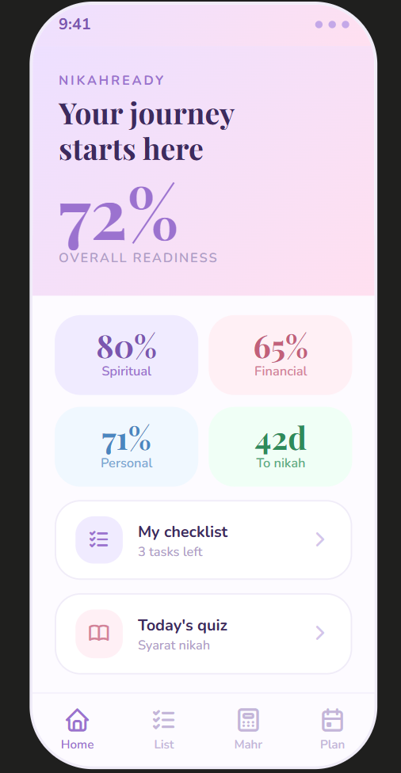
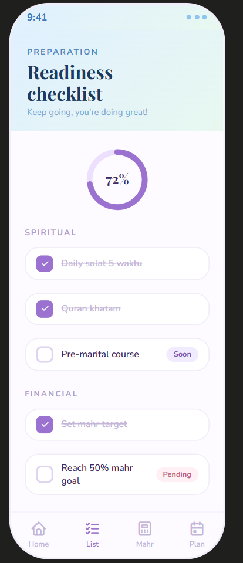
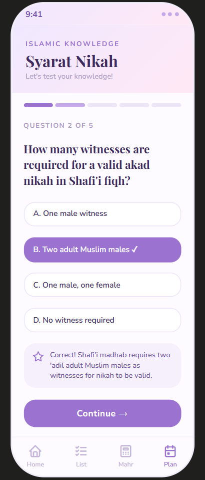

# 1. Group Members
* KHAIRUNNISA BINTI ABDULLAH, 2212506, [Assigned Role]
* [Full Name], [Matric Number], [Assigned Role]
* [Full Name], [Matric Number], [Assigned Role]
* [Full Name], [Matric Number], [Assigned Role]

# 2. Project Title
NikahReady: A Shariah-compliant Marriage Preparation App

# 3. Introduction

Problem Statement

Embarking on the path toward nikah is a monumental step, yet many young Muslims today find themselves navigating this process with limited guidance. Currently, there is a clear absence of centralized, Shariah-compliant digital tools designed to support the multifaceted needs of pre-marital preparation. As a young adults, we often rely on disjointed, manual methods to manage critical tasks such as evaluating personal financial readiness for mahr, tracking spiritual growth, and handling the complex logistics of wedding planning. This fragmentation leads to unnecessary stress and a lack of preparedness, as there is no single platform that integrates these spiritual and logistical responsibilities.

Motivation

Our team is motivated by the potential to bridge this gap using the skills we have acquired in mobile application development. We want to move beyond basic productivity apps and create something that is truly impactful for our peers. By leveraging the Flutter framework and Firebase backend services, we are driven to develop a robust, intuitive application that transforms the overwhelming "wedding preparation" phase into a structured and manageable roadmap. For us, this project is a chance to apply our technical knowledge toward a meaningful goal: helping our community build stronger, well-prepared marital foundations.

Relevance

The relevance of NikahReady is found in its alignment with the mobile-centric lifestyle of university students and young professionals who prioritize accessibility and efficiency. This application is not only a technical solution but a community-focused resource that addresses the urgent need for accessible fiqh education, financial literacy, and organizational structure in the context of marriage. By aligning all features with Islamic ethical standards, NikahReady provides a reliable, secure, and modern digital space that supports users in achieving spiritual and logistical readiness for their future.

# 4. Objectives

The main goal of this project is to build a practical mobile app that helps young Muslims prepare for marriage in an organized and stress-free way. 

Our specific objectives are:  
1. Help users track their readiness: We want to create a simple checklist and "readiness score" to help users see how prepared they are in their spiritual, financial, and personal lives.  
2. Simplify financial planning: We will build a Mahr calculator so users can easily estimate and plan their financial goals based on what they can afford.
3. Organize wedding details: We aim to create a digital planner that lets users track their budget, manage their list of vendors, and organize their wedding timeline in one place.
4. Provide educational tools: We will add a quiz module that helps users learn and test their understanding of important marriage rules (fiqh) and their future rights and responsibilities.
5. Apply technical skills: Our goal is to successfully use Flutter and Firebase to build a smooth, working app that fulfills all the project requirements for our course.

# 5. Target Users

NikahReady is designed to provide structured support to users at different stages of their marital journey. 

1. Individuals Preparing for Marriage:
   - This group consists of young Muslim adults, such as professionals between the ages of 20 and 30, who are actively getting ready for marriage. These users are digitally skilled and seek a unified, easy-to-use platform to manage the spiritual, financial, and logistical aspects of their preparation. By providing a clear roadmap, the application helps these users navigate the complexities of their upcoming transition with confidence and organization.
     
2. Newly Married Couples:
   - This group includes those who have recently entered into marriage and utilize the application to support their new life together. These users leverage the platform as a collaborative tool to maintain household budgets, establish long-term domestic objectives, and continue their personal growth through educational resources on marital rights and responsibilities. This ongoing use reinforces the application's role in fostering stable, well-informed, and harmonious partnerships.

# 6. Features & Functionalities

## 6.1 Checklist & Readiness Score

**Core Module:** A self-assessment module that evaluates the user's marriage readiness
across three dimensions: spiritual, financial, and personal.

**Key Interactions:**
- User ticks off checklist items under each category
- App calculates and updates a dynamic readiness score (0–100%) in real time
- Users can add custom checklist items beyond the default list
- Progress is saved to Firebase Firestore and persists across sessions

**UI Components:** Progress rings per category, checkboxes with labels, score
summary card, floating action button to add custom tasks

---

## 6.2 Mahr Calculator

**Core Module:** A financial planning tool to help users estimate, plan, and set savings
goals for mahr in accordance with Islamic guidelines.

**Key Interactions:**
- User inputs current savings, target mahr amount, and timeline (months)
- App calculates the required monthly savings to reach the goal
- Users can save and update their goal over time
- Brief fiqh notes are displayed to contextualise mahr types

**UI Components:** Input text fields with validators, calculated result card,
save button, informational tooltip/dialog for fiqh notes

---

## 6.3 Wedding Planner

**Core Module:** An integrated logistics organiser for managing wedding budget,
vendors, and timeline in a single interface.

**Key Interactions:**
- User sets a total wedding budget and logs expenses by category
- Budget balance updates in real time as expenses are added or removed
- User adds vendor entries (name, contact, service type, status)
- User sets key date milestones with a countdown to the wedding date
- Tasks can be marked as complete with due date reminders

**UI Components:** Budget summary card, expense list with category tags,
vendor directory list, milestone timeline, task checklist with due dates,
FloatingActionButton for adding entries

---

## 6.4 Islamic Knowledge Quiz

**Core Module:** An interactive educational module for users to learn and test their
understanding of nikah-related fiqh, rights, and responsibilities.

**Key Interactions:**
- User selects a quiz topic (syarat nikah, wali & witnesses, hak suami/isteri)
- Multiple-choice questions are presented one at a time
- Immediate feedback with explanation is shown after each answer
- Score summary and retry option are displayed at the end of each session

**UI Components:** Topic selection screen, question card with answer option buttons,
feedback dialog/snackbar, score result screen with retry and home navigation buttons

# 7. UI Mock-up

### Screen 1 — Dashboard

---

### Screen 2 — Checklist & Readiness Score

---

### Screen 3 — Mahr Calculator

---

### Screen 4 — Wedding Planner

---

### Screen 5 — Islamic Knowledge Quiz

## 8. Architecture / Technical Design

### State Management
This application uses the **Provider** package for state management. 
Provider allows efficient state sharing across widgets without 
unnecessary rebuilds, keeping the UI reactive and performant.

Each core module has its own Provider class:
- `ReadinessProvider` — manages checklist items and score calculation
- `MahrProvider` — manages mahr calculator inputs and result
- `WeddingProvider` — manages budget, vendors, and milestones
- `QuizProvider` — manages quiz questions, answers, and score

### Widget Structure

    lib/
    ├── main.dart
    ├── models/
    │   ├── checklist_model.dart
    │   ├── mahr_model.dart
    │   ├── vendor_model.dart
    │   └── quiz_model.dart
    ├── providers/
    │   ├── readiness_provider.dart
    │   ├── mahr_provider.dart
    │   ├── wedding_provider.dart
    │   └── quiz_provider.dart
    ├── screens/
    │   ├── dashboard_screen.dart
    │   ├── checklist_screen.dart
    │   ├── mahr_screen.dart
    │   ├── planner_screen.dart
    │   └── quiz_screen.dart
    └── widgets/
        ├── readiness_ring.dart
        ├── checklist_item.dart
        ├── vendor_card.dart
        └── quiz_option.dart

### Navigation
Named routes are used for screen navigation, defined in `main.dart`.

### Firebase Services Used
| Service | Usage |
|---|---|
| Firebase Authentication | Email/password login and registration |
| Cloud Firestore | Storing checklist, mahr goals, vendors, and quiz scores |

# 9. Data Model
[Include your Firestore collection-document diagram]

# 10. Flowchart/Sequence Diagram
[Include your user interaction/navigation flow]

# 11. References
* [Flutter Documentation](https://docs.flutter.dev)
* [Firebase Documentation](https://firebase.google.com/docs)
